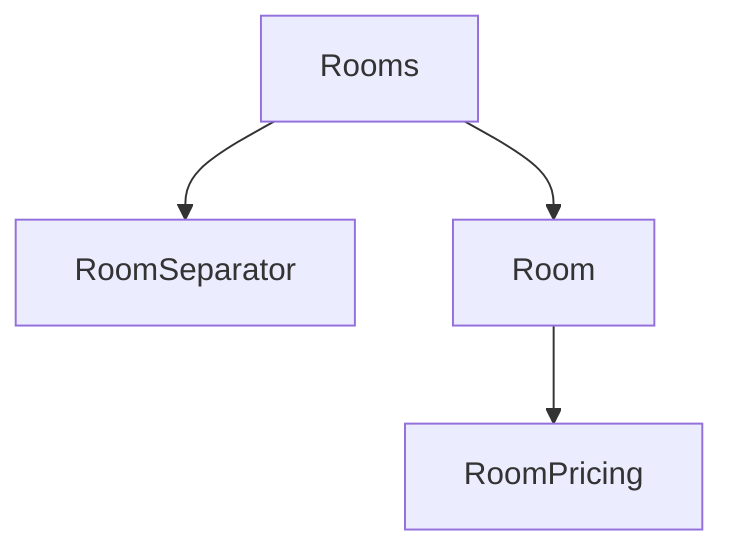

# Rooms/Room Deep Understanding (INTERNAL)

## Mapa rápido de componentes

- **Rooms**
  - Renderiza `RoomSeparator` y `Room`.
- **Room**
  - Renderiza `RoomPricing` y otros componentes hijos.
- **RoomSeparator**
  - Muestra títulos y subtítulos.

## Diagrama Mermaid del flujo de datos

## Tabla de componentes

| Componente    | Inputs (props/context) | Fuente real (hook/SSR/API) | Outputs (callbacks/render)                |
| ------------- | ---------------------- | -------------------------- | ----------------------------------------- |
| Room          | roomData               | Props desde Rooms.tsx      | Renderiza RoomPricing y otros componentes |
| RoomPricing   | N/A                    | Contenido estático         | Renderiza opciones de precios             |
| RoomSeparator | title, subtitle        | Props desde Rooms.tsx      | Renderiza título y subtítulo              |

## Lista de riesgos y preguntas abiertas

- **Riesgos**:
  - Acoplamientos entre componentes (Room y RoomPricing).
  - Prop drilling si se añaden más niveles de componentes.
- **Preguntas abiertas**:
  - ¿Qué sucede si `roomData` no contiene todos los campos esperados?
  - ¿Cómo se manejarán los cambios en las opciones de reserva?
